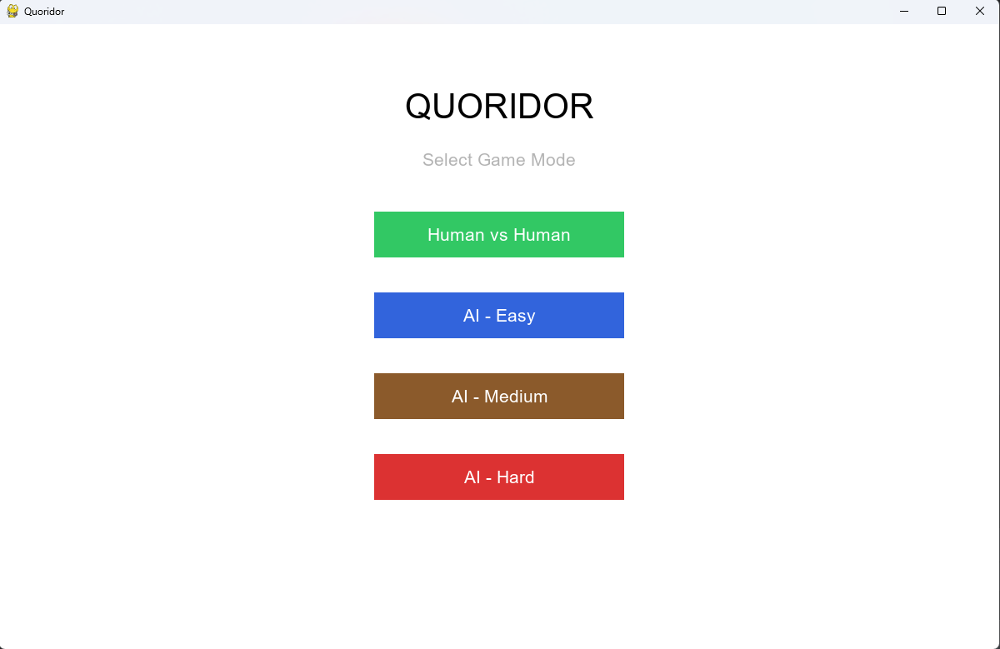
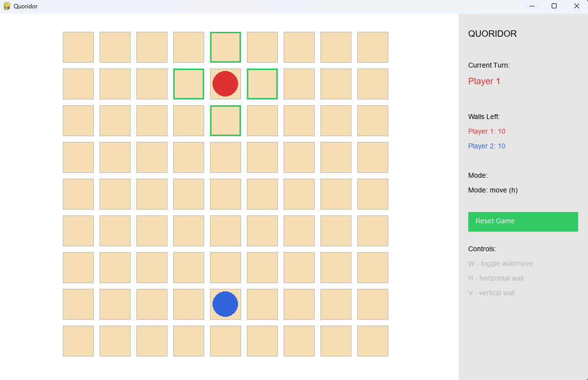
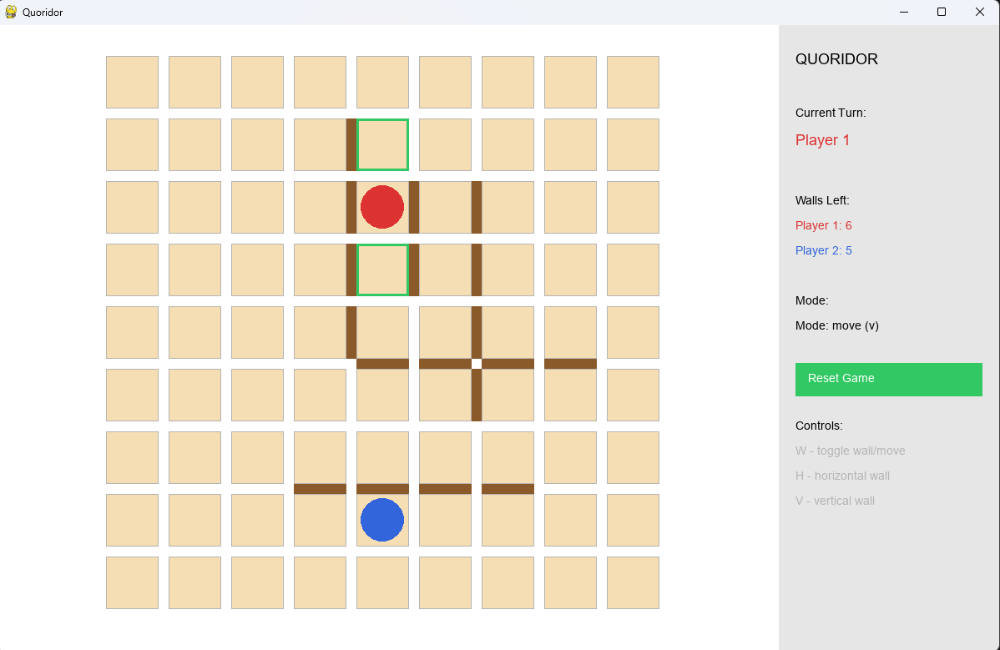
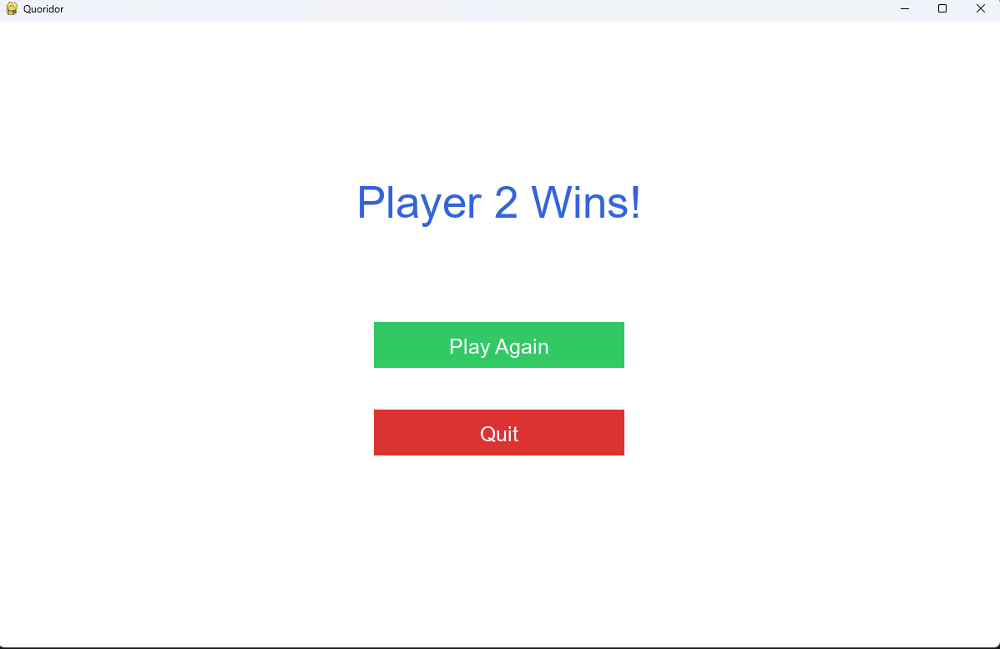

# Quoridor Game 🎯

A fully functional implementation of the classic strategy board game **Quoridor**, built in Python with Pygame. Features a complete GUI, an AI opponent with multiple difficulty levels, and all the original game rules including wall placement validation and jump mechanics.

---

## Team Members

| Name | ID |
|---|---|
| Yahia Yasser Fathy | 2301185 |
| Ahmed Ashraf Ahmed | 2300161 |
| Abdelrahman Khaled Aboellel | 2300818 |
| Basil Sherif Talaat | 2300045 |
| Abdallah Hesham Nasr | 2300718 |

---

## What is Quoridor?

Quoridor is a 2-player strategy board game played on a 9×9 grid. Each player starts on opposite sides of the board and the goal is simple — get your pawn to the other side before your opponent does. On each turn you either move your pawn one square or place a wall to slow your opponent down. Sounds easy, but it gets pretty intense.

---

## Screenshots

### Difficulty Selection Screen


### Gameplay


### Walls Placed


### Win Screen


---

## Features

- Full Quoridor ruleset for 2 players
- Human vs Human and Human vs AI game modes
- 3 AI difficulty levels — Easy, Medium, and Hard
- Wall placement with BFS validation (no trapping allowed)
- Jump mechanic with diagonal fallback
- Wall preview on hover so you know exactly where you're placing
- Valid move highlighting in green
- Resizable window
- Win screen with Play Again option
- Clean side panel showing turns, wall counts, and controls

---

## Installation

Make sure you have Python 3.11 installed — the game won't work on Python 3.14 because Pygame doesn't support it yet.

**1. Clone the repo:**
```
git clone https://github.com/ahmed0052/Quoridor-.git
cd Quoridor-
```

**2. Install Pygame:**
```
pip install pygame==2.5.2
```

**3. Run the game:**
```
python GUIMain.py
```

---

## How to Play

When you launch the game a difficulty selection screen appears. Pick your mode:

- **Human vs Human** — two players on the same keyboard
- **AI Easy** — good for learning the game
- **AI Medium** — decent challenge
- **AI Hard** — actually tries to beat you

---

## Controls

| Key | Action |
|---|---|
| Click | Move pawn / Place wall |
| W | Toggle between move and wall mode |
| H | Switch to horizontal wall |
| V | Switch to vertical wall |
| Reset Button | Go back to difficulty screen |

---

## Game Rules

- The board is 9×9
- Each player starts at the center of their baseline
- On your turn you either move your pawn or place a wall
- Pawns move one square at a time (no diagonals)
- If your opponent is directly in front of you, you can jump over them
- If a wall blocks the jump, you can move diagonally instead
- Walls are 2 squares long and can't be moved once placed
- You cannot place a wall that completely blocks either player from reaching their goal
- First player to reach the opposite side wins

---

## Project Structure

```
Quoridor-/
├── GUIMain.py        — main entry point, runs all screens
├── game.py           — all game logic (board, movement, walls, BFS, win condition)
├── AI.py             — Minimax AI with Alpha-Beta Pruning
├── ui.py             — all Pygame GUI classes
├── screenshots/      — screenshots for README
└── README.md
```

---

## AI Implementation

The AI uses **Minimax with Alpha-Beta Pruning**. It thinks ahead a certain number of moves depending on the difficulty level and picks the move that gives it the best position.

Positions are scored using BFS — the AI calculates how many steps each player needs to reach their goal and tries to minimize its own distance while maximizing the opponent's.

| Difficulty | Depth | Wall Range |
|---|---|---|
| Easy | 1 | No walls |
| Medium | 2 | 2 cells around pawns |
| Hard | 3 | 1 cell around pawns |

---

## Demo Video

> 🎬 [Watch the demo here](https://drive.google.com/drive/folders/1Kh2a3fNUw4ZDzZXY_96T6BCWQJigKmCW?usp=sharing)

---

## References

- [Official Quoridor Rules](https://en.gigamic.com/files/media/fiche_pedagogique/educative-sheet_quoridor_en.pdf)
- [Quoridor on BoardGameGeek](https://boardgamegeek.com/boardgame/624/quoridor)
- [Minimax Algorithm with Alpha-Beta Pruning](https://en.wikipedia.org/wiki/Alpha%E2%80%93beta_pruning)
- [BFS Pathfinding](https://en.wikipedia.org/wiki/Breadth-first_search)
- [Pygame Documentation](https://www.pygame.org/docs/)
